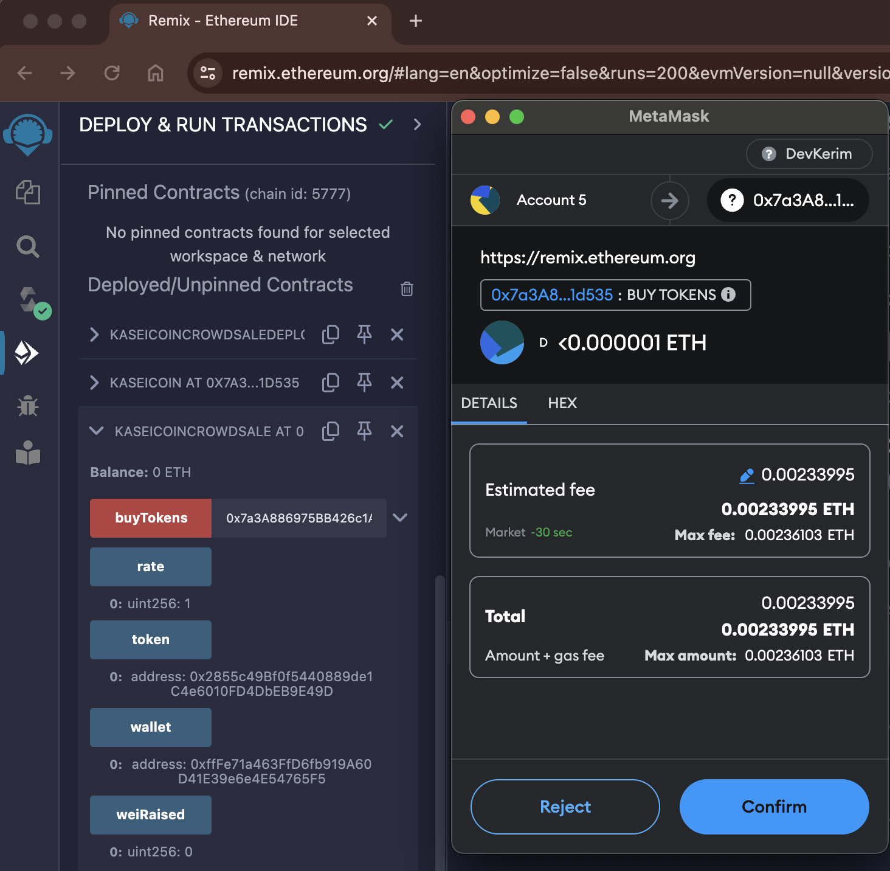
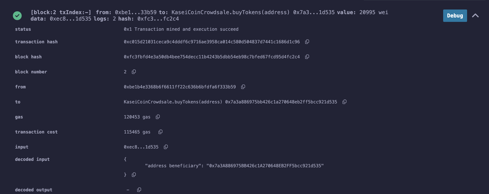

# Unit 21: Martian Token Crowdsale

### Compile KaseiCoin.sol and KaseiCoinCrowdsale.sol 

### MetaMask and Ganache

1. Deploy the crowdsale to a local blockchain by using Remix, MetaMask, and Ganache.

2. Test the functionality of the crowdsale by using test accounts to buy new tokens and then checking the balances of those accounts.

3. Review the total supply of minted tokens and the amount of wei that the crowdsale contract has raised.

